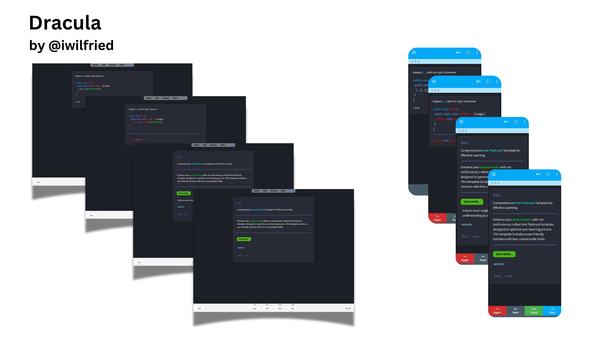
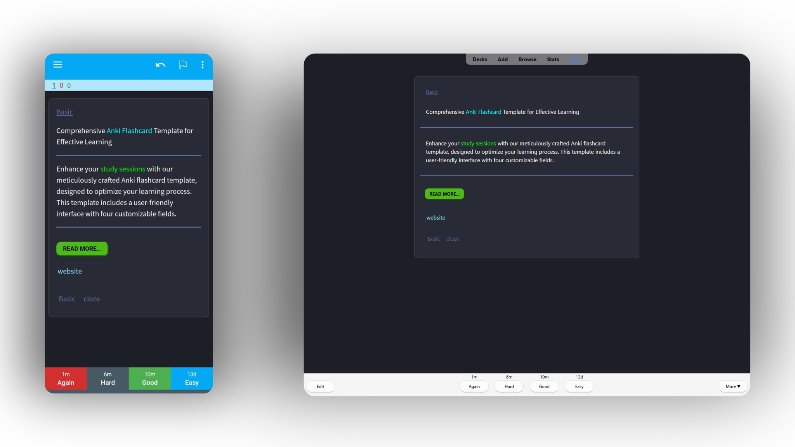
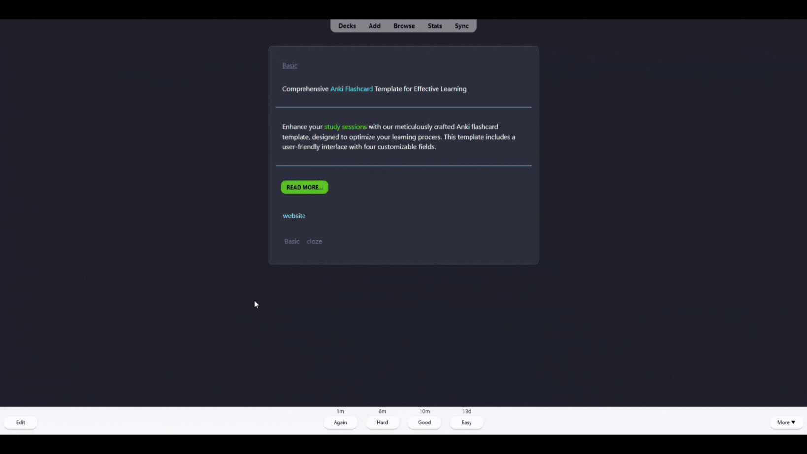
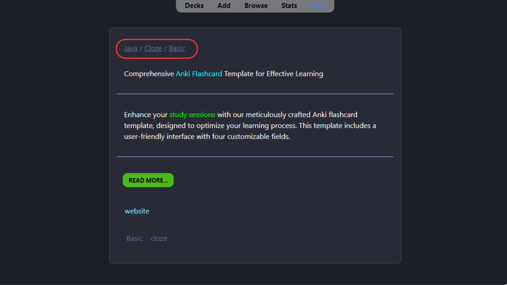
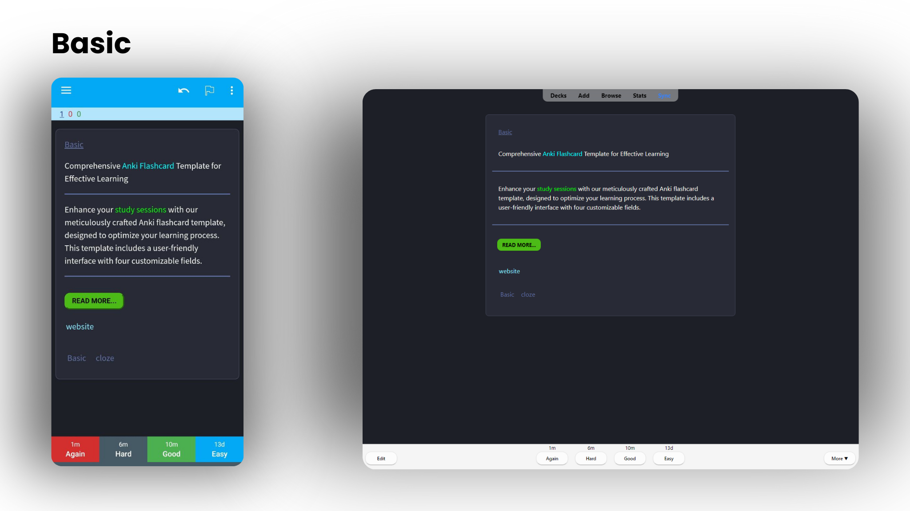
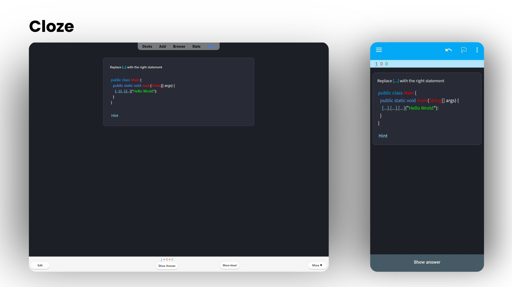
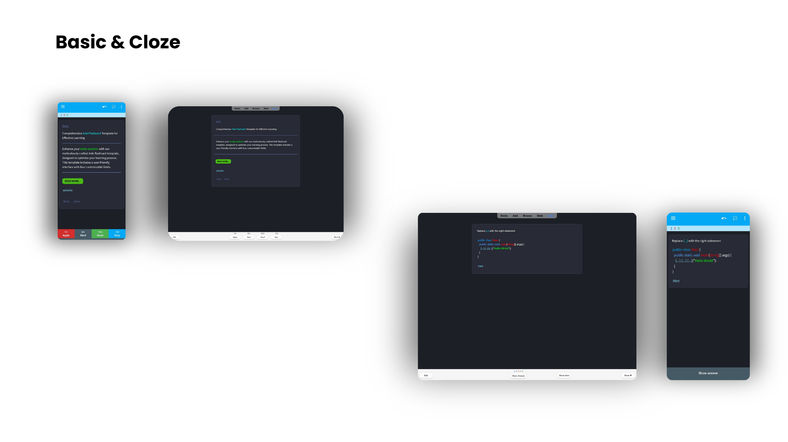

# Dracula

Collection of modern and clean Anki flashcard templates, fully customizable to suit your needs.

# Contents

- [About](#about)
- [Features](#features)
- [Themes](#themes)
- [Instructions](#instructions)
- [Add-on support](#add-on-support)
- [Compatibility](#compatibility)
- [Requirements](#requirements)

## About

Meticulously designed from the ground up, this template aims to make flashcards more visually engaging and minimize distractions, all while maintaining and even enhancing Anki's robust functionality.

## Features

### Responsive design

Supported on desktop, mobile and web!

### Tags for quick context

### Breadcrumbs to current deck

### More useful features

- Dark themes
- Customizable color palettes
- Preferences for tweaking styles
- Fast rendering using CSS with minimal JavaScript

## Themes

| Theme                                          | Download                                        | User Manual                                                          |
| ---------------------------------------------- | ----------------------------------------------- | -------------------------------------------------------------------- |
|  | [Basic](themes/Dracula/Basic.apkg)   | [Download](res/document/Document.pdf)                                      |
|  | [Cloze](themes/Dracula/Cloze.apkg)          | [Download](res/document/Document.pdf)                    |
|  | [Basic & Cloze](themes/Dracula/Dracula.apkg) | [Download](res/document/Document.pdf) |

## Instructions

### Installation

#### Direct download (Recommended)

- Click on link in the above table to download the deck with the specific theme.

- Download [`Dracula.apkg`](Dracula.apkg) to install all the themes in one master deck.

### Usage

1. Download the deck package
2. Open Anki and click on `Import File` (`⋮` -> `Import` in AnkiDroid)
3. Select the downloaded file
4. The new note type(s), `THEME-NOTETYPE` should be created automatically
5. Use the note type(s) or [clone](https://docs.ankiweb.net/editing.html#adding-a-note-type) to adapt to your needs

### Update

To update to the latest version of Prettify (themes/note types), just download the required decks again.

> **Warning**: The already existing templates and styles will be _overwritten_ once you import the deck with updated content. To avoid any loss of edits, it is highly recommended that you use clones of the downloaded note types. (Refer to [Anki manual - Adding a note type](https://docs.ankiweb.net/editing.html#adding-a-note-type) for instructions on cloning a note type).

## Add-on support

The following add-ons are currently supported

- [Clickable Tags](https://ankiweb.net/shared/info/1739176371)
- [Edit Field During Review (Cloze)](https://ankiweb.net/shared/info/385888438)

> **Note**: Add-ons are optional and not necessary. The templates work as expected _with or without_ the add-ons.

## Compatibility

Tested on

- **Desktop**: Anki 2.1.49+ (Mac)
- **Mobile**: AnkiDroid 2.15+
- **Browsers** (AnkiWeb): Chrome (97.0.4692.71+), Safari (15.0+)

> **Note**: Although tested on relatively newer versions of Anki, all the themes should work as expected with all versions of Anki 2.1+.

## Requirements

- Anki 2.1 or higher (should work with Anki 2.0)

